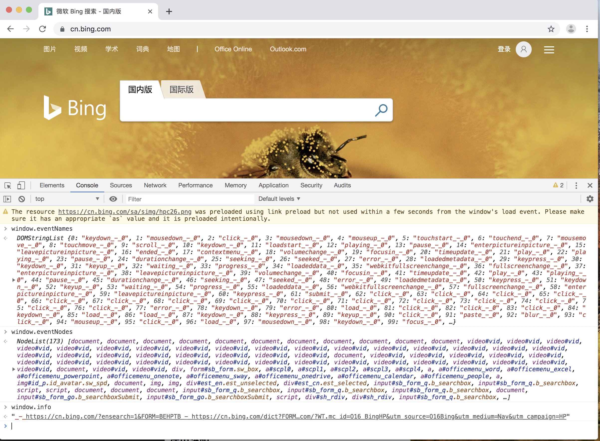

## 核心功能

通过修改chromium源码，主要实现两件动态爬虫中比较关注的两个功能：

1. 禁止当前页面被跳转，同时将即将跳转的URL收集起来备用。这里通过修改了一个比较底层的函数来实现的，不需要做各种场景的hook了。
2. hook当前页面绑定的所有非默认事件，并保留场景供后续触发。这样爬虫不需要遍历所有DOM节点了。

此外还有一些小功能：

1. 禁止浏览器下载文件。
2. 忽视掉"X-Frame-Options"头，即允许任意页面被iframe。
3. 禁止掉alert,print,confirm,prompt弹窗。
4. 禁止页面自己打开新窗口；将预备打开的新窗口的URL记录下来。

## 示例

OSX测试版：https://github.com/myvyang/chromium_for_spider/releases/tag/v1.0.0
Ubuntu测试版：TODO

打开页面后，由于页面跳转被hook了，因此无论如何点击(或执行任意JS)，应该页面都不会成功跳转。"待跳转的URL"会被记录到`window.info`中。

## 使用说明

通过修改chromium源码实现了核心功能后，在浏览器的`window`对象中增加了三个属性：`window.info`，`window.eventNames`，`window.eventNodes`。

其中`window.info`将页面中触发的跳转URL等记录了下来，使用`_-_`分割。

`window.eventNames`和`window.eventNodes`配合使用，`eventNames`为事件名称，例如`click`，`onmouseover`等；`eventNodes`为事件绑定的DOM节点，通过JS可以获取。使用例子见`ch_test/fireevent.html`。

## TODO

1. 添加编译好的Ubuntu/OSX包，直接使用
2. 更多功能
3. crash排查

## 编译

当前(20190517)使用的chromium版本为`dbc6c805b7430f401875d50b8566d9f743ca402b`，测试可以很容易就编译成功。可能随着时间推移，chromium的一些依赖会失效，如果失效了，请开issue提醒更新chromium版本。

时至今日chromium的编译已经非常简单了，根据官方步骤，选对开发版本(例如当前使用的`dbc6c805b7430f401875d50b8566d9f743ca402b`)，完全可以做到全程无warning。

官方文档见：`https://www.chromium.org/developers/how-tos/get-the-code`。

1. 先安装官方步骤，下载源码并准备好环境。
2. `git checkout dbc6c805b7430f401875d50b8566d9f743ca402b`切换到制定版本。
3. `gclient sync`，这一步可能会有报错。如果错误是chromium的某个模块，删除掉该模块继续执行这条命令。
4. `git apply path/to/dbc6c805b7430f401875d50b8566d9f743ca402b.diff`应用这个补丁。
2. `gn args out/Release`添加args.gn里的参数(可选，不影响可用性)。
3. `gn gen out/Release`生产编译文件。
4. `autoninja -C out/Release chrome`开始编译。

Mac上可执行文件在`src/out/Release/Chromium.app/Contents/MacOS/Chromium`，Ubuntu上可执行文件在`src/out/Release/chrome`。

